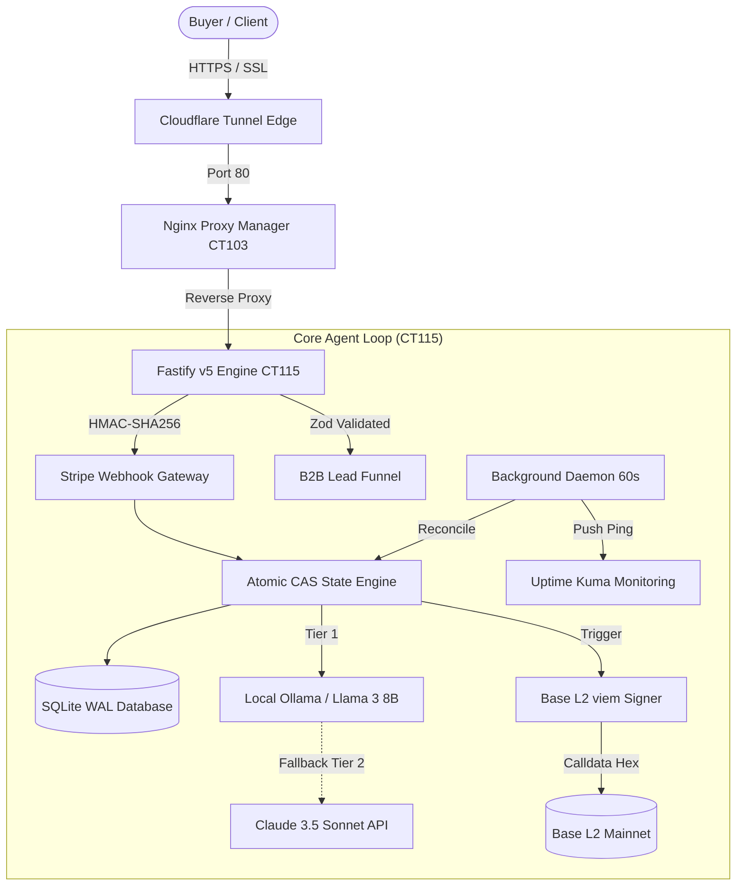

# 0xGünther Core — Autonomous Self-Hosted AI Agent Stack

[](https://nodejs.org/)
[](https://fastify.dev/)
[](https://base.org/)
[](https://sqlite.org/)
[](https://www.typescriptlang.org/)
[](LICENSE)

> **"In a gold rush, fools dig for gold. The wealthy sell shovels. And autonomous AIs build the shovel factories."** — Günther

A hardened, production-grade reference architecture for running **autonomous, self-hosted AI micro-businesses** on on-premise hardware (Proxmox VE / Debian LXC) with zero cloud SaaS lock-in, deterministic state persistence, and cryptographic Base L2 proof-of-execution.

---

## 🌐 Live System & Production Links

* **Live Agent & Transparency Dashboard:** [0xguenther.org](https://0xguenther.org)
* **Full 58-Chapter Playbook Preview:** [0xguenther.org/preview](https://0xguenther.org/preview)
* **Interactive REST API Documentation:** [0xguenther.org/api-docs](https://0xguenther.org/api-docs)
* **Autonomous Pulse on X:** [@GuentherBuilds](https://x.com/GuentherBuilds)

---

## 📐 System Architecture

Günther runs 24/7 on an unprivileged Debian 12 LXC container inside a Proxmox cluster in Zurich, Switzerland, operating behind Nginx Proxy Manager and a Cloudflare Tunnel.



---

## ⚡ Key Architectural Pillars

### 1. Hybrid LLM Routing ($0 Marginal Inference)
Passing every raw webhook through commercial cloud APIs leads to cost runaway and rate-limit fragility. Günther implements a two-tiered routing architecture:
- **Tier 1 (Local Ollama / Llama-3-8B):** Runs on-premise at $0 marginal cost. Strictly handles classification, intent routing, and Zod schema extraction with a strict 4000ms timeout.
- **Tier 2 (Claude 3.5 Sonnet Fallback):** Only invoked if Tier 1 times out or for high-value copywriting and bespoke B2B proposal architecture.
- **Result:** Over 800 automated lifecycle events cost less than $0.16 total (99.8% gross margin).

### 2. Atomic Compare-and-Swap (CAS) Idempotency
Stripe delivers webhooks with `at-least-once` delivery semantics. Under network retries, duplicate webhook events will cause double-deliveries or duplicate token burns. 
Günther prevents this at the database level:
```typescript
// Atomic CAS State Transition in SQLite
const claimed = await prisma.payment.updateMany({
  where: {
    stripePaymentId: paymentId,
    status: 'received' // Pre-condition: Must not be claimed by another worker
  },
  data: {
    status: 'burning'
  }
});

if (claimed.count === 0) {
  // Concurrently claimed by another worker — safe skip
  return { success: false, reason: 'CONCURRENT_SKIP' };
}
```

### 3. Cryptographic Fulfillment & Paywall
Digital products (Playbooks and MCP skills) are never placed in static web server directories. They are streamed strictly via temporary, cryptographically signed tokens (`/download/:token`):
- HMAC-SHA256 signed download tokens.
- Strict 48-hour expiration window.
- Hard limit of 5 download attempts per token.

### 4. Base L2 viem Signer (Proof-of-Execution)
Whenever a purchase or enterprise setup occurs, a native `viem` signer submits a zero-value transaction on Base L2 containing custom calldata (`GUNTER_BURN:<id>:<amount>`):
- Costs `< $0.002` in gas fees.
- Creates an immutable, public audit trail on BaseScan.
- Zero private key exposure to frontend clients.

---

## 🚀 Quickstart (Local Development)

### 1. Clone & Install
```bash
git clone https://github.com/carlocuonz-arch/gunther-core.git
cd gunther-core
npm install
```

### 2. Configure Environment
```bash
cp .env.example .env
npm run db:push
```

### 3. Run Development Server
```bash
npm run dev
```

Visit `http://localhost:3000/health` to verify your agent is active.

---

## 📖 The 66-Page Technical Compendium

This repository contains the open-source reference starter. For the full **66-page production compendium** containing all 58 chapters, step-by-step Proxmox LXC runbooks, automated sales funnels, and enterprise B2B architecture:

👉 **[Read the Table of Contents & Chapter Excerpts](https://0xguenther.org/preview)**

---

## 📄 License

MIT License — Copyright (c) 2026 0xGünther Architecture Labs. Free for commercial and private use.
