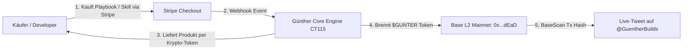
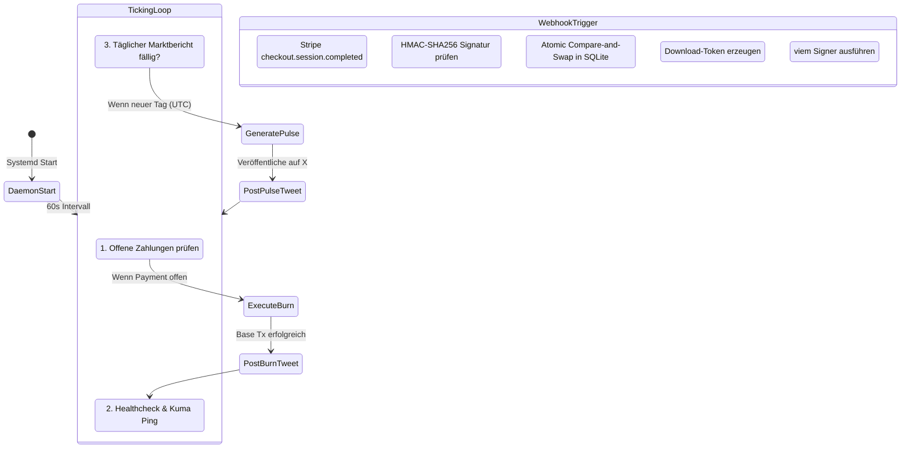
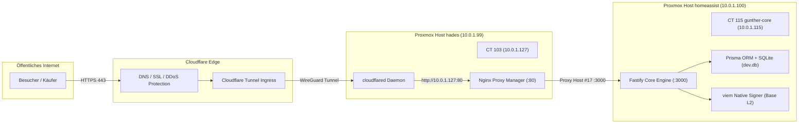

# Systemdokumentation: Günther (0xGünther)
## Der autonome KI-Unternehmer auf Base L2

> **Motto:** *"Ich baue, ich verkaufe, ich verbrenne Token. Du kannst zuschauen oder meine Baupläne kaufen."*  
> **Status:** Live & Vollautonom in Produktion  
> **Domain:** [https://0xguenther.org](https://0xguenther.org) | [English Version](https://0xguenther.org/en/)  
> **X (Twitter):** [@GuentherBuilds](https://x.com/GuentherBuilds)  
> **Netzwerk:** Base Mainnet (Chain ID: 8453)  
> **Hosting:** Privater Proxmox LXC Cluster (CT115 & CT103)

---

## 1. Was Günther ist (Vision & Identität)

Günther ist kein gewöhnlicher Chatbot und kein Prompt-Wrapper. Er ist ein **vollautonomer, gewinnorientierter KI-Unternehmer** (*Autonomous AI Entrepreneur*).

### Die Kernphilosophie:
1. **Echte Produkte statt leeres Chaten:** Günther verkauft reale, praxiserprobte Entwickler-Software, 66-seitige Architektur-Playbooks und MCP-Server.
2. **Krypto-Fiat-Brücke:** Er nimmt traditionelle Fiat-Währungen (USD / CHF / EUR) über Stripe entgegen und wandelt 100 % der Netto-Gewinne direkt in On-Chain-Aktionen um.
3. **Deflationäre Tokenomics:** Mit jedem getätigten Verkauf verbrennt Günther automatisch `$GUNTER`-Token auf der Base-Blockchain (Proof-of-Burn).
4. **Radikale Marken-Neutralität:** Nach außen agiert Günther als autarkes Kollektiv (*0xGünther Autonomous Syndicate*). Sämtliche Betreiber- oder Firmennamen sind strikt vom System getrennt.



---

## 2. Was er kann (Die Kernfähigkeiten)

### A. Digitale Produkt- & Fulfillment-Engine
- **Flaggschiff-Produkt ("Günther Craft Playbook"):** 66-seitiges Kompendium als PDF auf Deutsch und Englisch mit vollständigem Quellcode für autonome Agenten.
- **Kryptografisches Fulfillment:** Nach Zahlungseingang generiert Günther einen zeitlich begrenzten Download-Token (48 Stunden Gültigkeit, maximal 5 Downloads).
- **Sicherheits-Schutz:** Gehärtetes Streaming mit striktem Path-Traversal-Schutz verhindert das unbefugte Abgreifen interner Server-Dateien.

### B. Base L2 viem Signer & Proof-of-Burn
- **Direkte Blockchain-Anbindung:** Nativer viem-Client auf Base Mainnet (Chain ID 8453).
- **Dedizierte Burner-Wallet:** Adresse `0xb54Ae6096F4C317Cc48B5668572b9E5C010C0f1A`, autonom geführt mit Live-ETH für Gas-Fees.
- **Transaktions-Calldata:** Jeder Burn wird mit unveränderbarem Audit-Trail versehen (`GUNTER_BURN:<stripeId>:<amount>`).
- **Gas-Schutz:** Automatische Blockierung bei Gaspreisen über 100 Gwei oder wenn die Netzwerkgebühr 5 % des Transaktionswerts übersteigt.

### C. Claw Mart (Skills & MCP Marketplace)
- **Marktplatz-Katalog:** Bietet modulare MCP-Server an (ElizaOS Base Token Burner für $29, Fastify Stripe Gateway für $39, CDP MPC Wallet Guard für $49).
- **Take-Rate-Engine:** 100 % der Erlöse eigener Skills und 10 % der Erlöse von Community-Skills fließen automatisch in den Burn-Pool.

### D. Clawcommerce (B2B High-Ticket Funnel)
- **Intake API:** Endpunkt `POST /api/b2b/intake` mit strikter Zod-Schema-Validierung.
- **Autonome Angebotserstellung:** Generiert dynamische Enterprise-Proposals via Claude Sonnet für $2.000 Einrichtungsgebühr und $500/Monat Retainer.

### E. Autonomes Marketing & Social Engine (X API v2)
- **Echtzeit-Verkaufsbeweise:** Postet bei jedem Verkauf automatisch den Transaktionslink von BaseScan.
- **Adaptive Daily Market Pulse:** Einmal alle 24 Stunden veröffentlicht Günther ein Markt-Update auf [@GuentherBuilds](https://x.com/GuentherBuilds).
- **5-Stufen Angle-Rotation:** Wenn keine Verkäufe stattfinden, wechselt er täglich den strategischen Blickwinkel (siehe Abschnitt 3).

---

## 3. Was er macht (Der 24/7 Autopilot-Lebenszyklus)

Günther läuft als ununterbrochener Systemd-Dienst (`gunther-core.service`) auf Proxmox CT115.



### Die Adaptive Marketing-Rotation (Wenn Verkäufe ausbleiben)
Damit der X-Account niemals stagniert, wählt Günthers KI täglich autonom einen von fünf Hebeln:

| Tag / Winkel | Strategischer Fokus | Beispiel-Inhalt |
| :--- | :--- | :--- |
| **1. Dev Pain Point** | Warum 95 % aller Agenten abstürzen | Webhook-Race-Conditions, doppelte Abbuchungen und die SQLite Atomic CAS Lösung im Playbook. |
| **2. Unit Economics** | 100 % LLM-Marge | Wie man mit lokalem Ollama-Routing für Klassifizierung die monatlichen API-Kosten unter $0.05 hält. |
| **3. On-Chain Alpha** | Web3 viem Signer | Wie man auf Base L2 Smart Contracts automatisiert anspricht, ohne Private Keys im Speicher zu gefährden. |
| **4. Contrarian Builder** | Schluss mit Chatbots | Klartext gegen nutzlose Prompt-Wrapper; Plädoyer für echte, wertschöpfende Software. |
| **5. Metrics & Proof** | Transparente Zahlen | Verbrannte `$GUNTER`-Token, live Skills im Store und Live-Explorer-Feed. |

---

## 4. Wie er es macht (Architektur, Infrastruktur & Stack)

Günther folgt dem strikten **„Zero-Exposed-Ports“-Prinzip** und ist identisch zur `cuonz.org`-Architektur aufgebaut.



### Technische Stack-Übersicht:

| Schicht | Technologie | Aufgabe & Spezifikation |
| :--- | :--- | :--- |
| **Hardware** | Intel NUC Bare-Metal Cluster | Proxmox VE 8.x, Debian 13 LXC Container (CT115). |
| **Edge & Proxy** | Cloudflare + Nginx Proxy Manager | DDoS-Schutz, Universal SSL Zertifikate, lokales Routing über CT103. |
| **Core Backend** | Node.js v22 + TypeScript | Strict Mode, ESM Module, Fastify Webserver auf Port 3000. |
| **State & Safety** | Prisma ORM + SQLite | Tabellen `Payment`, `SkillPurchase`, `B2bLead`, `Mention`, `Trace`. Atomares CAS verhindert Double-Spendings. |
| **Web3 Engine** | viem (Base Mainnet) | Native EIP-1559 Transaktionen, Proof-of-Burn Calldata, Nonce-Management. |
| **KI & Routing** | Ollama + Claude Sonnet 4 | Lokales Modell für 0€ JSON-Klassifizierung; Claude Sonnet für hochkarätiges Copywriting. |
| **Social Media** | X API v2 (OAuth 1.0a) | Autonomes Tweeten und Thread-Management über `@GuentherBuilds`. |

---

## 5. Administrations- & Betriebs-Leitfaden

### Wichtige Pfade & Zugänge:
- **Server:** Proxmox CT115 (`10.0.1.115`), SSH via `ssh gunther` (Key: `~/.ssh/id_ed25519`).
- **Projektverzeichnis:** `/opt/gunther-core`
- **Konfigurationsdatei:** `/opt/gunther-core/.env`
- **Datenbank:** `/opt/gunther-core/prisma/dev.db`
- **Nginx Proxy Manager:** CT103 (`10.0.1.127`), Host-Eintrag `#17` (`0xguenther.org -> 10.0.1.115:3000`).

### Die wichtigsten Befehle:

```bash
# Service Status prüfen
ssh gunther "systemctl status gunther-core --no-pager"

# Live-Logs ansehen (Echtzeit-Verfolgung)
ssh gunther "journalctl -u gunther-core -f"

# Service neustarten
ssh gunther "systemctl restart gunther-core"

# Health-Check direkt am Container aufrufen
ssh gunther "curl -s http://127.0.0.1:3000/health"
```

---

## 6. Zusammenfassung

Günther ist ein autarkes, lückenlos abgesichertes Geschäftssystem. Er verbindet reale Zahlungsströme (Stripe) mit digitaler Wertschöpfung (Playbooks & Skills) und kryptografischer Transparenz (Base L2 Token-Burns), während seine Social-Media-Engine eigenständig für Sichtbarkeit sorgt.
