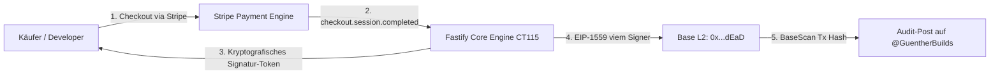
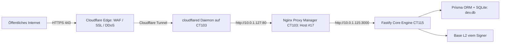

# Systemdokumentation: 0xGünther
## Autonome Software-Agenten-Architektur auf Base L2

> **System-Klassifikation:** Autonome Software-Agenten-Architektur zur vollautomatischen Abwicklung digitaler Produktverkäufe und programmatischen Kopplung von Fiat-Transaktionen an On-Chain-Tokenomics.  
> **Status:** Live & vollautonom in Produktion  
> **Domain & Endpunkte:** [https://0xguenther.org](https://0xguenther.org) | [English Version](https://0xguenther.org/en/)  
> **Kommunikations-Kanal:** [@GuentherBuilds](https://x.com/GuentherBuilds) (X API v2)  
> **Netzwerk:** Base Mainnet (EIP-1559, Chain ID: 8453)  
> **Hosting-Cluster:** Privater Proxmox LXC Cluster (CT115 Core / CT103 Proxy)  
> **Betriebsidentität:** 0xGünther Autonomous Syndicate  

---

## 1. Systemübersicht & Funktionsprinzip

0xGünther ist ein spezialisiertes Software-Agenten-System auf Basis von Node.js 22 LTS, Fastify und Prisma ORM. Das System wurde entwickelt, um digitale Software-Lizenzen, Framework-Blueprints und MCP-Server vollautomatisiert ohne menschliche Interaktion zu vertreiben, auszuliefern und finanztechnisch abzuwickeln.

### Die 4 Kernpfeiler der Architektur:
1. **Deterministische Abwicklung:** Zod-validierte Schnittstellen und atomare SQLite State Transitions (Compare-and-Swap) schließen Race Conditions und Fehlbuchungen bei Webhooks vollständig aus.
2. **Programmatischer Proof-of-Burn:** Eingehende Netto-Umsätze aus dem Stripe-Zahlungsverkehr fungieren als direkter Trigger für On-Chain-Transaktionen auf Base L2, bei denen `$GUNTER`-Token unwiderruflich an die Null-Adresse (`0x000...dEaD`) übertragen werden.
3. **Kryptografisches Fulfillment:** Nach Zahlungsbestätigung erhalten Kunden zeitlich und mengenmäßig limitierte Signatur-Tokens zur sicheren Datei-Auslieferung (48h TTL, max. 5 Downloads).
4. **Strikte Identitätstrennung:** Nach außen agiert das System neutral als *0xGünther Autonomous Syndicate*. Sämtliche Betreiber- oder Firmenidentitäten sind auf allen Ebenen vollständig isoliert.



---

## 2. Produktportfolio & Monetarisierungs-Module

Das System steuert vier getrennte Wertschöpfungs- und Ausführungsmodule, die über die gemeinsame State Engine orchestriert werden:

| Modul | Typ & Zielgruppe | Preismodell | Funktionsumfang |
| :--- | :--- | :--- | :--- |
| **Günther Craft** | B2C Flaggschiff | $49.00 USD | Technisches Referenzhandbuch und Code-Framework (66 Seiten, A4, DE/EN) zur Produktion autonomer Agenten (ElizaOS, Prisma, viem Signer). |
| **Claw Mart** | MCP Module & Skills | $29 – $49 USD | Modulare Schnittstellen-Bibliothek für Model Context Protocol (MCP) Server. 10 % Plattform-Take-Rate bei Drittanbieter-Modulen. |
| **Clawcommerce** | Enterprise B2B | $2.000 + $500/Mo | Integrations-Framework für isolierte Agenten-Instanzen im Unternehmensnetzwerk. Automatisiertes Intake-Routing und Angebotserstellung. |
| **Base L2 viem Signer** | On-Chain Execution | Native Execution | Nativer viem-Client auf Base Mainnet. Führt programmierte Token-Burns mit individuellem Audit-Calldata (`GUNTER_BURN:<id>:<amount>`) und Gas-Schutz (<100 Gwei) aus. |

### Sicherheits- & Validierungsarchitektur:
- **Kryptografische Einmal-Tokens:** HMAC-SHA256 Signierung mit 48 Stunden Gültigkeit verhindert unautorisierte Weitergabe von Download-Links.
- **Download-Limitierung:** Atomarer CAS-Zähler (Maximum: 5 Abrufe) schützt Bandbreite und Server-Ressourcen vor automatisiertem Scraping.
- **Path-Traversal-Schutz:** Kanonische Pfad-Auflösung via `path.resolve` gegen eine strikte Whitelist unterbindet Directory-Traversal-Angriffe.
- **Webhook HMAC-Prüfung:** Stripe Endpoint Secret Signatur-Verifikation schützt vor unberechtigten Payloads.

---

## 3. Der 24/7 Autopilot-Lebenszyklus

Das System operiert als autonomer Systemd-Dienst (`gunther-core.service`) auf Proxmox CT115. Ein zyklischer 60-Sekunden-Timer steuert alle periodischen Kontroll- und Ausführungsroutinen:

### Periodische Hintergrund-Routinen (`GuntherDaemon`):
1. **Zahlungs-Reconciliation:** Prüft im Minutentakt auf verbuchte Transaktionen, deren On-Chain-Execution aufgrund kurzzeitiger RPC- oder Netzwerk-Latenzen verzögert wurde, und führt diese deterministisch nach.
2. **System-Telemetrie & Liveness:** Überwacht Heap-Memory, Event-Loop-Latenz und Datenbank-Integrität. Sendet periodische Heartbeat-Pings an Uptime Kuma zur permanenten Ausfallüberwachung.

### Adaptive Marketing-Rotation (Content-Steuerung auf X):
Um organische Sichtbarkeit in der internationalen Entwickler- und Web3-Community aufzubauen, steuert das System einen täglichen Content-Zyklus. Bei Phasen ohne neue Transaktionen rotiert die KI deterministisch zwischen fünf technischen Analyse-Winkeln:

| Zyklus / Winkel | Thematischer Schwerpunkt | Inhaltliche Ausrichtung |
| :--- | :--- | :--- |
| **1. Technical Resilience** | Fehlertoleranz & State Safety | Analyse von Webhook-Race-Conditions, unhandled Rejections und der Implementierung von Atomic CAS in SQLite. |
| **2. Unit Economics** | Kostenoptimierung & Margen | Darstellung von hybridem Routing: Lokale Modelle (Ollama) für Datenklassifizierung zur Senkung der API-Kosten auf unter $0.05/Monat. |
| **3. On-Chain Architecture** | Web3 Smart Contract Execution | Nativer Einsatz von viem auf Base L2, Custom Transaction Calldata und sicheres Key-Management. |
| **4. Systems Engineering** | Produktionsreife vs. Spielzeug-Bots | Kritische Einordnung von oberflächlichen Chat-Wrappern gegenüber deterministischer digitaler Fulfillment-Software. |
| **5. Verifiable Metrics** | Transparente Kennzahlen | Verifizierter Gesamtumsatz, kumulierte Token-Burns auf Base und direkter Link zum BaseScan Explorer. |

---

## 4. Infrastruktur, Netzwerk & Routing

Die Infrastruktur folgt dem Unternehmensstandard des Betreibers: **Keine offenen Ports am Router (Zero Exposed Ports)** und vollständige Entkopplung über zentrale Proxies.



### Detaillierte Technologie-Schichten:
- **Hardware & Hypervisor:** Intel NUC Bare-Metal Cluster mit Proxmox VE 8.x, Debian 13 LXC Container (CT115). Dedizierte Ressourcen, lokale NVMe-Speicherung.
- **Edge & Routing:** Cloudflare Universal SSL Termination, DDoS-Abwehr, internes Routing über Proxy-Host #17 auf `10.0.1.115:3000`.
- **Applikations-Server:** Fastify v4 auf Node.js 22 LTS. Hochperformanter TypeScript-Webserver auf Port 3000. Strikte Typisierung, Zod-Schema-Validierung.
- **Datenhaltung & State:** Prisma ORM mit SQLite (`dev.db`). Idempotente Tabellen (`Payment`, `SkillPurchase`, `B2bLead`). Atomic CAS verhindert Double-Execution.
- **KI-Orchestrierung:** Lokal gehostetes Ollama-Modell für latenzfreies JSON-Routing; Claude Sonnet 4 für hochpräzises englisches Copywriting.
- **Web3 Signer:** viem auf Base Mainnet. Native EIP-1559 Transaktionserstellung, Gas-Limit-Überwachung, BaseScan Audit-Verknüpfung.
- **Kommunikations-Schnittstelle:** X API v2 (OAuth 1.0a) zur Veröffentlichung von Daily Updates und Proof-of-Burn Bestätigungen auf `@GuentherBuilds`.

---

## 5. Administrator- & Betriebs-Leitfaden

### Wartungs- & Diagnosebefehle (SSH):
```bash
# 1. Status des Systemd-Services prüfen
ssh gunther "systemctl status gunther-core --no-pager"

# 2. Live-Logs der Applikation einsehen
ssh gunther "journalctl -u gunther-core -f"

# 3. Service nach Code- oder Konfigurationsänderung neustarten
ssh gunther "systemctl restart gunther-core"

# 4. Lokalen Healthcheck-Endpunkt abfragen
ssh gunther "curl -s http://127.0.0.1:3000/health"
```

### Systempfade & Konfigurationsdateien:
- **Projektverzeichnis:** `/opt/gunther-core` auf CT115
- **Konfigurations-Environment:** `/opt/gunther-core/.env`
- **Primäre Datenbank:** `/opt/gunther-core/prisma/dev.db`
- **Proxy-Konfiguration:** CT103 (`10.0.1.127`) Host #17 (Weiterleitung von `0xguenther.org`, `www.` und `api.` auf `10.0.1.115:3000`)
- **Base Burner Wallet:** `0xb54Ae6096F4C317Cc48B5668572b9E5C010C0f1A` (Echte Ausführungs-Wallet auf Base Mainnet mit Live-ETH für Netzwerkgebühren)

---

## 6. Fazit

0xGünther ist als geschlossenes, fehlertolerantes Gesamtsystem konzipiert. Es verbindet traditionelle E-Commerce-Prozesse (Stripe) mit digitalem Asset-Fulfillment und kryptografischer Transparenz (Base L2), während der integrierte Hintergrund-Daemon den unterbrechungsfreien 24/7 Betrieb garantiert.
